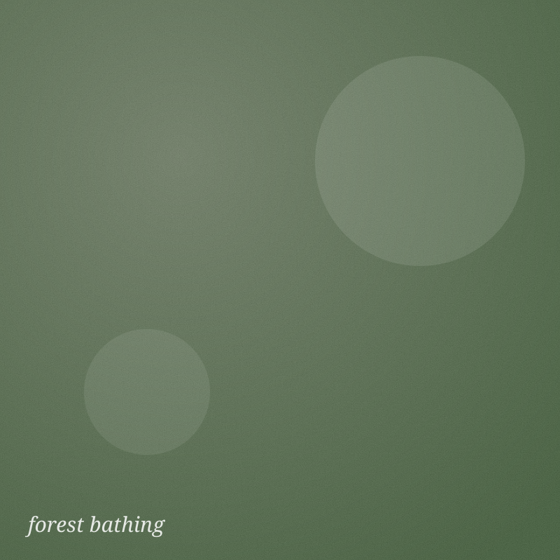

# Psychosomatic Bodywork — site

A plain HTML/CSS/JS site built around a **square-grid lattice**. No build step, no framework.

## Files
```
index.html        landing page (demos every grid modality)
article.html      long-form journal/blog layout
assets/grid.css   the grid SYSTEM + all styling (edit variables at the top)
assets/grid.js    keeps rows square + draws the per-edge lines
assets/img/        placeholder SVGs — swap in your own photos
```

## The grid in 30 seconds
Wrap cells in `<main class="grid">`. Each cell:

```html
<div class="cell cell--image" data-span="2x2" data-edges="t r b l">
  <div class="cell__media"></div>
</div>
```

- **`data-edges`** — which sides show a line: any of `t r b l` (space-separated), `all`, or omit for none. This is the on/off switch for every edge.
- **`data-span`** — footprint: `1x1` (default), `2x2`, `2x1`, `1x2`, `3x1`, `2x3`, `4x1`.
- **Cell types**: `cell--image`, `cell--text`, `cell--word`, `cell--quote`, `cell--review`, `cell--offer`, `cell--article`, `cell--cta`, plus `cell--paper` (cream fill) on any of them.

## Change the look in one place
Edit the variables at the top of `assets/grid.css`:

```css
--cols: 4;            /* squares per row     */
--line-color: #fff;   /* line colour         */
--line-width: 5px;    /* line thickness      */
--tick: 12px;         /* corner overshoot    */
--grid-bg: #a6dd9c;   /* the green           */
```
Recolour just one cell's lines: `style="--cell-line:#c8a24a"` on that cell.

## Hosting on GitHub Pages
1. Create a repo (e.g. `bodywork-site`), upload these files to the root.
2. Repo **Settings → Pages → Build and deployment → Source: Deploy from a branch**, branch `main`, folder `/ (root)`.
3. Live at `https://<username>.github.io/<repo>/` in ~1 min. A custom domain can be added on the same Pages screen.

## Booking
Embed Cal.com (open-source, free tier handles single sessions + packages) or Calendly into `booking.html`:
```html
<!-- Cal.com inline embed -->
<div style="width:100%;height:700px" id="cal"></div>
<script src="https://app.cal.com/embed/embed.js"></script>
<script>Cal("inline",{elementOrSelector:"#cal",calLink:"your-handle/first-session"});</script>
```

## Reviews
Testimonials are hardcoded `cell--review` blocks so they can appear anywhere
(landing, offerings, footer). Replace the placeholder quotes with real ones as
you collect them. A Google Business Profile can be layered in later.
